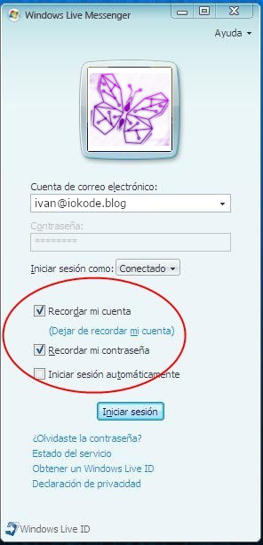

Hace unos días mantuve una conversación por teléfono con [Sergio](https://twitter.com/sergiobarriel), en la que me preguntó sobre qué medidas de ciberseguridad tomo durante el desarrollo de software. Le respondí por teléfono como pude, pero me parece interesante ampliar por aquí la información que pude darle, así como hacerla pública para que lo pueda leer toda persona a la que esto le pueda ser útil.

Lo primero que le dije, y creo que es muy importante señalar, es que **yo no soy un experto en ciberseguridad** y que, aunque me lo tomo muy en serio, **jamás podría asegurar que mis aplicaciones son 100% seguras** y que nadie encontrará nunca una vulnerabilidad. Hacer esta afirmación, aparte de mentir, sólo demostraría arrogancia por mi parte.

Una vez dicho esto, en esta entrada voy a enumerar y explicar aquellas medidas de seguridad que suelo tener en cuanta cuando desarrollo software.


## Medidas generales
Estas son una series de medidas, que podrían aplicarse a cualquier tipo de aplicación.

### No _hardcodear_ información sensible en el código.
Esto es simple, no escribir directamente en el código ningún tipo de información sensible como credenciales o tokens de autenticación.

Aunque distribuyas una aplicación en forma de binarios, hay herramientas con las que es relativamente sencillo descompilarlo y acceder al código. Si escribes información sensible en un string, cualquiera con acceso a los binarios podría descompilarla y extraerla (y eso sin hablar de los lenguajes interpretados donde directamente ejecutas un fichero de texto con el código).

Escribirlas en un comentario tampoco es una opción, pues, aunque se van a perder durante la compilación, el código original sigue existiendo y podría filtrarse. Si crees que esto es casi imposible porque tendrían que acceder a tus servidores privados y descargar el código, debes de saber que a Micrososft se le filtró el código de Windows XP.

### Mantener los ficheros de configuración que tienen información sensible fuera del directorio de desarrollo.
No he sido el primero, ni seré el último al que le ha pasado esto, pero he de admitir que me ha ocurrido. He subido a GitHub un fichero de configuración que tiene tokens de acceso a servicios que usa mi aplicación. Cuando esto ocurre, es una odisea eliminarlos, pues Git mantiene un historial de cambios en el tiempo, y no basta con añadir un commit nuevo que elimine el fichero. Es importante por lo tanto evitar subir ficheros de configuración con información sensible a un sistema de control de versiones, incluso en repositorios privados.

Aunque es bastante común encontrar como solución a esto, simplemente mantener el fichero de configuración ignorado, en mi opinión no es suficiente. También debería de estar lejos de los ficheros de código (es decir, fuera del directorio del proyecto), dado que, aunque esté ignorado, es fácil por error equivocarse y forzar su commit.

Por suerte para los desarrolladores .NET, Microsoft nos provee un solución bastante cómoda llamada user-secrets, que consiste en mantener los ficheros de secretos en el directorio personal (`%APPDATA%\Microsoft\UserSecrets\` en Windows, `~/.microsoft/usersecrets/` en Linux y macOS).

### Cifrar el tráfico con SSL
Cuando desarrollo una aplicación que se comunica con otras mediante algún mecanismo como pueden ser sockets TCP, intento que el tráfico vaya cifrado mediante un sistema de cifrado asimétrico. Generalmente suelo utilizar certificados X.509 para ello.


## Medidas en aplicaciones web
Existen ciertas vulnerabilidades conocidas que podrías introducir en tu aplicación web. Veamos algunas de ellas y cómo mitigarlas.

### Utilizar siempre HTTPS
Esto es algo muy básico, pero siempre que se desarrolla una aplicación web, se debe de configurar el servidor para que utilice HTTPS. Esto permite que todo el tráfico entre el servidor web y el navegador vaya cifrado, útil para evitar que un tercero pueda interceptar datos, como por ejemplo los introducidos en un formulario.

Otra ventaja de utilizar HTTPS, es que permite al navegador autenticar al servidor mediante firma digital, por lo que si posee un certificado emitido para Microsoft, podemos estar bastante seguros de que el sitio web pertenece a Microsoft (comprobar el nombre de dominio por sí sólo no es suficiente, ya que pueden haber envenenado el servidor DNS).

### Cifrar todas las cookies
Las cookies generalmente almacenan datos que nos son útiles en el servidor, sin embargo, el usuario podría modificarlas manualmente en su navegador, afectando así al funcionamiento esperado de la aplicación web.

Cifrar las cookies en el servidor, y descifrarlas al recibirlas, nos permite protegernos de que un usuario malintencionado no las modifica, ya que para ello tendría que ser capaz de descifrarla, hacer la modificación y volver a modificarla, algo que en principio no debería de poder hacer porque la clave de cifrado no debería de salir del servidor.

Algunos frameworks de desarrollo web como [Laravel](https://laravel.com) permiten cifrar todas las cookies antes de ser enviadas, por lo que una vez configurado, no tendrás que preocuparte de hacerlo en cada punto que la aplicación haga set de una cookie.

### Protección contra ataques XSS
Un ataque XSS es un tipo de ataque que permite a un usuario inyectar código (generalmente JavaScript) en un sitio web que no es de su propiedad. Veamos un ejemplo. Imagina el siguiente fragmento de código PHP, esto podría ser un foro o la zona de comentarios de un blog:
```php
<?php
$comments = get_comments_from_database();
?>

<div class="comments">
    <?php foreach ($comments as $comment) { ?>
        <div class="comment">
            <p><?= $comment ?></p>
        </div>
    <?php } ?>
</div>

<form method="post" action="insert-comment.php">
    <label for="comment-content">Contenido del comentario</label>
    <textarea id="comment-content" name="comment-content"></textarea>
    <button type="submit">Enviar comentario</button>
</form>
```

El código del fichero `insert-comment.php` sería algo así:
```php
<?php
$comment = $_POST["comment-content"];
save_comment_into_database($comment);
```

Se esperaría que un usuario introdujese un comentario y lo enviase, este se guardaría en la base de datos, y se adjuntaría al HTML para mostrarlo en la lista de comentarios. Esto es, si un usuario escribiese "Hola, esto me parece muy interesante", el HTML que se generaría sería algo como esto:

```html
<div class="comments">
    <div class="comment">
        <p>Comentario anterior</p>
    </div>
    <div class="comment">
        <p>Hola, esto me parece muy interesante</p>
    </div>
</div>
```

Pero... ¿qué ocurriría si un usuario escribiese lo siguiente en el textarea?
```
<script>window.location.replace("http://evil.example.com");</script>
```
El HTML generado sería el siguiente:
```html
<div class="comments">
    <div class="comment">
        <p>Comentario anterior</p>
    </div>
    <div class="comment">
        <p><script>window.location.replace("http://evil.example.com");</script></p>
    </div>
</div>
```
Esto haría que a partir del momento en el que se envió ese comentario, al acceder al listado de comentarios, el navegador ejecutaría el código JavaScript y por lo tanto redireccionaría al sitio web malicioso `evil.example.com`.

La forma de evitar este ataque es comprobar siempre los datos que ha introducido el usuario, y dependiendo del contexto de la aplicación, eliminar de esos datos cualquier parte de código susceptible a ser interpretado. Muchos frameworks de desarrollo web incorporan herramientas que limpian los datos antes de colocarlos en los una vista. Por ejemplo, en [ASP.NET Core](https://dotnet.microsoft.com/en-us/apps/aspnet), el sistema de plantillas Razor por defecto limpia cualquier entidad HTML antes de colocarlas en una vista, a no ser que se le especifique explícitamente que no lo haga con el método `Html.Raw`.

### Evitar robo de cookies
El robo de cookies (secuestro de sesión) consiste en robar una cookie de un navegador para ser introducida en otro navegador controlado por un atacante. Hay varias formas de robar las cookies, siendo un ataque XSS que accede a la cookie a través de JavaScript una de las más comunes. Hay otras formas de robar cookies, no utilizar HTTPS habilitaría a cualquiera que escuche el tráfico hacerse con las cookies, un malware instalado en el navegador que envíe a un atacante las cookies establecidas.

Cifrar una cookie por sí mismo no evitaría el secuestro de cookies, y evitarlo completamente es complicado. Aquí puedo dar una serie de recomendaciones:
- Establece el tiempo de vida de las cookies al menor posible. Haz que el servidor las rechace una vez superado el TTL.
- Establece siempre los atributos `Secure` y `HttpOnly`. El primero indica al navegador que no envíe las cookies si no es por HTTPS y el segundo que no sean accesible desde scripts en el cliente.
- Intenta asociar algún dato extra a la sesión como el User-Agent o la dirección IP. Si la petición proviene con una misma cookie de sesión, pero un navegador distinto, entonces cierra esa sesión desde el servidor.


### Nunca cambiar el estado el estado con peticiones GET
Es algo bastante habitual ver en aplicaciones webs que hay rutas que con una simple petición GET, estas realizan alguna acción que afectan al estado. Quizás el caso más común sea que al visitar /logout, esta cierra la sesión del usuario. El problema de esto, es que un sitio externo podría enviar una petición GET desde tu navegador a la ruta (con un simple `` por ejemplo).

Esto es lo que se conoce como un ataque CSRF (o XSRF), y para evitar esto, todas las peticiones que hagan un cambio sobre el estado, deberían de tener un verbo diferente a GET o HEAD. POST suele ser una buena elección por la compatibilidad con los formularios.

### Verificar tokens CSRF
Usar rutas POST para hacer acciones que afecten al estado de la aplicación, puede ayudar a mitigar algunos ataques CSRF simples como el mencionado anteriormente, pero no es suficiente ya que el ataque anterior podría realizarse con que simplemente la web atacante tenga algo similar a esto:

```html
<form type="post" action="example.com/logout">
    <button type="submit">Pulsa aquí para continuar</button>
</form>
```

Para evitar esto, se suelen utilizar tokens CSRF, que no es más que un token que si no va incluido en la petición POST, esta no será procesada. Prácticamente cualquier framework de desarrollo web suele llevar resuelta la generación y verificación de tokens CSRF y middleware para comprobarlos antes de procesar una petición diferente a GET o HEAD.

Si por cualquier motivo no estás utilizando un framework de desarrollo web, sería tan sencillo como generar un string aleatorio, asociarlo a la sesión e incluirlo en todos los formularios como un `<input type=”hidden” />`. Cuando vayas a procesar peticiones POST, verificar que el token está presente y corresponde con el token guardado en la sesión.


## Medidas en aplicaciones que acceden a datos
Cuando se acceden a datos provenientes de una fuente externa, también es posible dejar alguna vulnerabilidad altamente conocida.

### No construir quieries con datos que provienen de fuentes externas.
Es algo común encontrar aplicaciones que utilizan datos que provienen de una fuente externa, y para acceder ellos construyen expresiones que representan que datos debe de traer de la fuente externa (lo que comúnmente se conoce como una query).

Por requisito de muchas de estas aplicaciones, hay veces que la expresión construida depende de datos de entrada, por ejemplo, digamos que tu aplicación requiere obtener todos los datos relativos al primer cliente cuyo apellido sea introducido por el usuario. Para lograr eso, la aplicación podría construir una query similar a esta:

```cs
string familyName = PromptUser("What is the family name?");
string query = "from customers where family_name equals '" + familyName + "' get first";
var result = RunQuery(query);
```

El problema de esto es que un usuario malicioso podría de forma relativamente sencilla alterar la query introduciendo algo similar a esto en el prompt `a' or is_admin equals '1`, haciendo que la query construida finalmente sea `from customers where family_name equals 'a' or is_admin equals '1' get first`, por lo que la aplicación obtendría los datos del primer usuario administrador.

La forma más sencilla de solucionar este problema es evitar construir queries con datos que provienen de una fuente externa (no únicamente la entrada del usuario). De esta forma la query nunca se modifica con los datos que ha introducido el usuario, y estos se envían al proveedor de datos en forma de parámetros. El resultado sería algo similar a esto:

```cs
string familyName = PromptUser("What is the family name?");
string query = "from customers where family_name equals '?' get first";
var result = RunQuery(query, familyName);
```

Está bastante extendido tomar estas medidas de seguridad cuando se construyen queries SQL, sin embargo, esto no es un problema en sí de SQL, si no que podría ser una vulnerabilidad siempre que se construyan queries con datos que vienen desde fuentes que no controlamos, y por desgracia no es tan común verlo aplicado a otros tipos de queries. He visto casos de inyección tanto en queries GraphQL como en MongoDB.

### Cifra aquella información sensible
Cuando almacenes en la base de datos información sensible como contraseñas o números de tarjeta, cifra esta información de forma que si se filtra el contendido de la base de datos, el impacto sobre datos sensibles sea el menor posible. Recomendaría hacer esto directamente desde la aplicación, pero hay algunos [DBMS](https://iokode.blog/post/2022/por-que-usar-una-base-de-datos) como RavenDB que permiten cifrar toda la base de datos entera, siendo este cifrado trasparente a la aplicación.


## Medidas en aplicaciones que almacenan credenciales de usuarios

### Delega la autenticación
Si tu aplicación no requiere que tú almacenes los usuarios, si no que te sirve con simplemente poder diferenciarlos, añade los botones de "Login with Google", "Login with Apple" y olvidate de gestionar tú la autenticación. Esto no es posible en todo tipo de aplicaciones, dado que puedes necesitar usuarios que no tengan cuenta en estos proveedores, ser una aplicación sin acceso a Internet, etc., pero si es posible hacerlo, te ahorrarás trabajo y problemas.

### Hashea las contraseñas
Esto es lo mismo que he expuesto arriba sobre cifrar la información sensible que guardes en las bases de datos. Sin embargo, con las contraseñas podemos ir un paso más allá y deberíamos de guardar un hash (cifrado) en vez de la contraseña en sí. Con las contraseñas nunca interesa leerla, si no comprobar que es correcta, y esto se puede guardando únicamente un hash. Cuando el usuario introduce su contraseña, esta se hasheará y se compararán los hashes. De esta forma, evitas que ante un robo y descifrado de la base de datos, no podrá acceder a las contraseñas.

Por favor, utiliza algoritmos de hash diseñados específicamente para contraseñas y no MD5 o SHA-1. El algoritmo bcrypt puede ser una buena opción.

Si vas a incluir un [salt](https://es.wikipedia.org/wiki/Sal_(criptograf%C3%ADa)) en el hashing, como ya hemos dicho arriba, no lo hardcodees (aunque bcrypt ya incluye salt por defecto, por lo que no sería necesario añadirlo manualmente).


## Algunas estrategias de mitigación
Como podemos observar, la seguridad es algo muy complicado, pues en prácticamente cualquier punto de tu aplicación podrías estar introduciendo una vulnerabilidad sin darte cuenta. Es muy difícil estar al tanto de todos los factores.

### Conoce las vulnerabilidades más comunes
Para reducir el número de vulnerabilidades que puedes introducir en tu aplicación, es importante conocer las más comunes. Esta entrada podría ser un buen comienzo de algunas de las vulnerabilidades más conocidas, pero en Internet hay cientos de páginas con información más ampliada sobre cientos de vulnerabilidades comunes. Invertir algo de tiempo en investigarlas y comprobar que no se te haya colado alguna en tu aplicación suele ser una buena práctica.

### _Piensa como un atacante_
Otra idea para intentar mitigar las vulnerabilidades, es _pensar como un atacante_. Pongamos un ejemplo:

Imagina una aplicación de escritorio de chat en la que tienes un botón de recordar usuario y contraseña.



Esta aplicación guarda las credenciales en un fichero cifrado de forma que si es examinado no pueda ser leído. La aplicación cuando se abre descifra el fichero y almacena esas credenciales en memoria. Quizás simplemente podría hacer un dump de la memoria de la aplicación para extraer las credenciales en plano...

¿Cómo podría evitar esto?

### Auditoría de ciberseguridad
Existen empresas especializadas en la búsqueda de vulnerabilidades, que emplean equipos de personas especializados en vulnerabilidades y con personal que _piensa como un atacante_. Si estás desarrollando un proyecto suficientemente importante, quizás convendría plantearse contratar los servicios de una auditoría de seguridad.

¿Alguna de estas empresas querría patrocinarme esta entrada o el blog? 😏